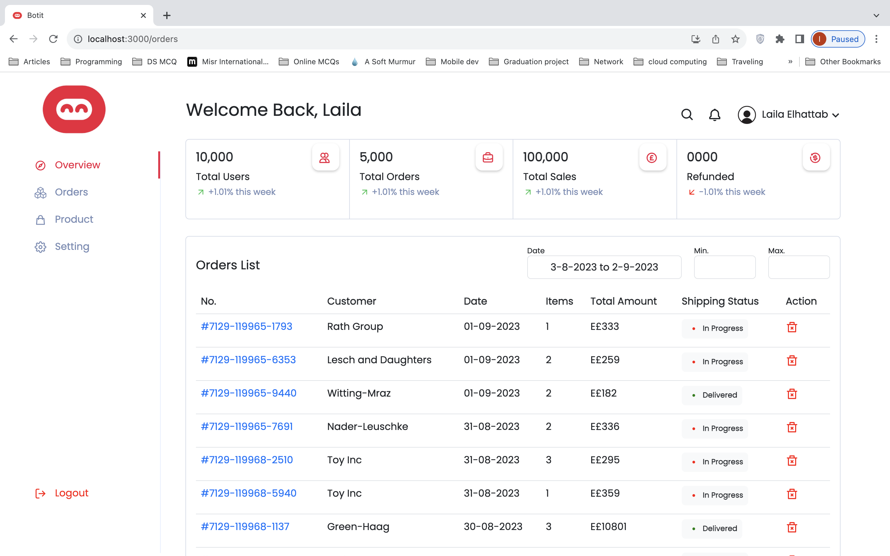
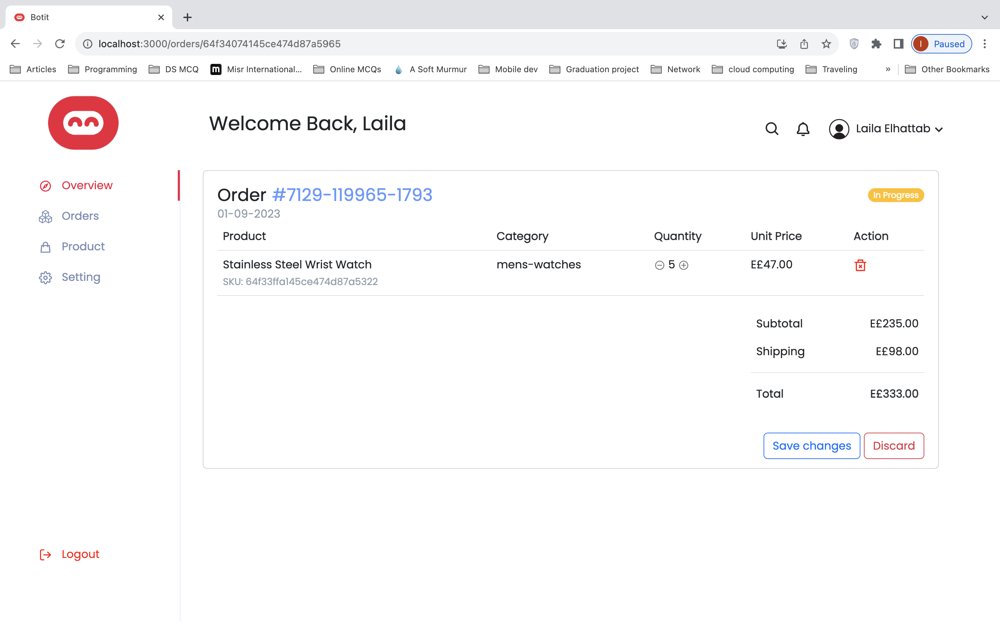

# Order-management-dashboard

This project involves the development of a full-stack order dashboard. The dashboard is designed to retrieve order and product data, display order summaries, and enable order modifications.\
\



## Technologies Used
* Frontend: React
* Backend: Node.js (Express.js for APIs)\
MongoDB for database 

## Dependencies Installation

```bash
# Backend Dependencies
npm install dotenv express mongoose jsonwebtoken bcryptjs cors cookie-parser  --save
npm install nodemon --save-dev
```
```bash
# Frontend Dependencies
npm install react-router-dom
npm install axios
npm install react-avatar bootstrap
npm install @amir04lm26/react-modern-calendar-date-picker
npm install moment
npm install react-use
npm install react-contexify


```
## Running the app
To populate the database with sample data, navigate to insert-data.js file inside the server folder and run:
```bash
node insert-data.js
```
Afterwards, navigate back to app.js to run the actual system.
```bash
# Run only server
node app.js
```
```bash
# Run only client
npm start
```
